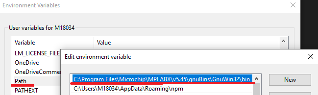
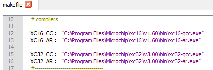

Read-me File for making X2C Scope Libraries for MCUs 
-----------------------------------------------
This file contains the following sections:
1. Summary
2. How to execute
3. How to create new target
4. Troubleshooting

### 1. Summary
This folder contains a makefile and \*.mk files for target specification. 
The makefile compiles the X2C Scope source files for the target MCUs.

### 2. How to execute

#### **Prerequisites**

1. Compilers: XC16 and/or XC32 and/or XC-DSC http://microchip.com/xc
1. GNU Make: MPLAB X IDE contains it: http://microchip.com/mplabx 
1. Modify system path environment to make.exe be available in command line: C:\Program Files (x86)\Microchip\MPLABX\\__*v5.20*__\gnuBins\GnuWin32\bin 

4. Modify makefile compiler paths to your XC compiler installation paths:

#### **Execute**
Open cmd in the root folder and execute "make" command. The main makefile will call all \*.mk file in the folder and compile all targets.

#### **Clean**
Execute "make clean" to delete all obj and lib files.

### 3. How to create new/custom target
If new target or custom configuration(Scope_size) required just duplicate one of the \*.mk file and modify the following variables to the needs:
1. TARGET_FILENAME - The output filename. (Will be located in the dist folder after compilation.)
1. OBJDIR - Folder to store the temporary object files. Must start with underscore(_) and must be different than other .mk files!
1. SET_PROCESSOR - Use XC Readme.html for the list of supported Devices. (xc32\v2.xx\docs)
1. DEFINE_X2C_MCU_FAMILY - Check the X2C Scope header files for details. Keep as it is.
1. DEFINE_SCOPE_SIZE - Allocated memory area for scope buffer.
1. OPTIMISATION - Compiler optimisation level

Then just execute the make command in the folder and makefile will call automatically the newly created .mk file.

### 4. Troubleshooting

* 'make' is not recognized as an internal or external command, operable program or batch file.
  * Set Path environment as described in the Prerequisites section. (See at **Prerequisites**)
* The system cannot find the file specified.
  * Edit makefile and set the correct compiler paths according to your system. (See at **Prerequisites**)